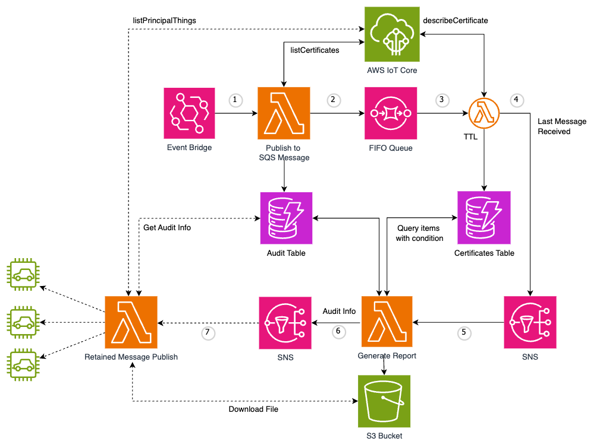

# IoT Device Certificate Management and Audit Workflow

## Table of Contents
1. [Overview](#overview)
2. [Key Features](#key-features)
3. [Architecture](#architecture)
4. [Prerequisites](#prerequisites)
5. [Installation](#installation)
6. [Usage](#usage)
7. [Components](#components)
8. [Workflow](#workflow)
9. [API Gateway](#api-gateway)
10. [Configuration](#configuration)
11. [Troubleshooting](#troubleshooting)
12. [Contributing](#contributing)
13. [License](#license)

## Overview

This project provides a solution for auditing IoT device certificates using AWS services. It offers an automated, scalable and cost efficient solution to audit IoT device certificates registered in [AWS IoT Core Registry](https://docs.aws.amazon.com/iot/latest/developerguide/thing-registry.html). It also generates report for certificates which are candidate for rotation and raises alert that may be used to start the certificate rotation pipeline. The solution is designed to help organizations maintain security and compliance in their IoT ecosystems by keeping track of certificate lifecycle.

The solution provides following two configuration options:  

1. Alert on ‘duration in use’  -  Audit and report if a certificate has been in use for ‘n’ days. This is useful in scenarios where the ask is to use long validity certificates (5 - 15 yrs) but rotate them periodically (say after every year) eg automotive use cases where a vehicle can remain offline for an extended period of time and the certificate might expire before there is an opportunity to rotate that.

2. Alert on ‘time to expire’ - Notify ‘n’ days ahead of expiry of certificate. With this option, customers get flexibility to define a duration that fits their use case, eg automotive customers want the notification 6 months to 1 yr in advance while there are customers who want notification just a few days in advance of expiry of certificates.

[Device certificate expiring](https://docs.aws.amazon.com/iot-device-defender/latest/devguide/audit-chk-device-cert-approaching-expiration.html) check of [AWS IoT Device Defender - Audit](https://docs.aws.amazon.com/iot-device-defender/latest/devguide/device-defender-audit.html) (DD) provides the same capability but currently the alert window is fixed to 30 days before expiration of the certificate. This project provides an alternate solution for use cases where 30 day window is a limitation. Efforts have been made to keep the implementation close to DD so that in future if DD has this functionality, it's easier for customers to migrate to DD. 

## Key Features

- Automated listing and processing of IoT certificates
- Storage of certificate details in [Amazon DynamoDB](https://aws.amazon.com/pm/dynamodb/)
- Generation of audit reports for expiring or expired certificates
- RESTful API for interacting with the system
- Scalable architecture using AWS serverless services
- Scheduled execution using [Amazon EventBridge](https://aws.amazon.com/eventbridge/)
- Efficient processing using [Amazon SQS](https://aws.amazon.com/sqs/) for task distribution
- Notification system using [Amazon SNS](https://aws.amazon.com/sns/)
- Secure storage of audit reports in [Amazon S3](https://aws.amazon.com/s3/)

## Architecture

The solution leverages several AWS services to create a robust and scalable architecture:

- [Amazon API Gateway](https://aws.amazon.com/api-gateway/) for creating and managing APIs
- [AWS Lambda](https://aws.amazon.com/lambda/) for certificate processing and audit report generation
- Amazon DynamoDB for storing certificate and audit data
- Amazon S3 for storing audit reports
- Amazon SQS for queuing certificate processing tasks
- Amazon SNS for notifications
- Amazon EventBridge for scheduling

## Prerequisites

Before getting started, ensure you have the following:

- An AWS account with appropriate permissions
- [AWS CLI](https://aws.amazon.com/cli/) installed and configured with your credentials
- Python 3.7 or later installed on your local machine
- Git for cloning the repository

## Installation

1. Download the CloudForamtion template from `src/iot_dd_audit_upgrade.yml`

2. Upload ClouFormation Template to the CloudFormation Console, set the values, and deploy

3. Once deployed, the system will automatically start processing certificates and generating audit reports based on the configured schedule. Alternatively you can make use of API GW APIs to interact with the solution.

4. Vailidate the Cloudformation Teamplate execution in the Cloudformation console.

## Components

1. **API Gateway**: Provides RESTful API endpoints for interacting with the system.

2. **Certificate Processing Lambda**: Lists active IoT certificates and sends their IDs to an SQS FIFO queue.

3. **SQS Queue Processor Lambda**: Processes each certificate, retrieving detailed information and storing it in DynamoDB.

4. **Audit Report Generation Lambda**: Identifies expiring or expired certificates, generates a JSON report, and uploads it to S3.

5. **DynamoDB Tables**: Store certificate details and audit information.

6. **S3 Bucket**: Stores the generated audit reports.

7. **SNS Topic**: Sends notifications when the audit process is complete.

8. **EventBridge Rule**: Schedules the periodic execution of the certificate processing.

## Workflow

1. An EventBridge rule triggers the certificate processing Lambda function periodically.
2. The Lambda function lists all active IoT certificates and sends their IDs to an SQS FIFO queue.
3. The SQS queue processor Lambda, triggered by the queue, processes each certificate:
   - Retrieves detailed certificate information
   - Stores the details in a DynamoDB table
4. Once all certificates are processed, a notification is sent to an SNS topic.
5. This notification triggers the audit report generation Lambda function, which:
   - Identifies expiring or expired certificates
   - Generates a JSON report
   - Uploads the report to an S3 bucket
   - Sends a notification to SNS Topic to trigger further workflow
6. The API Gateway provides endpoints for clients to interact with the system, such as retrieving audit reports or initiating manual audits.

## API Gateway

The API Gateway in this project serves as the main entry point for external interactions with the system. It provides a RESTful interface for various operations related to certificate management and auditing.

Key features of the API Gateway implementation:

- RESTful API design
- Secure access control using IAM
- Integration with Lambda functions for backend processing
- Support for different stages (e.g., development, production)

Available endpoints:

1. `POST /start-audit`: Trigger a manual audit process. Please note you can only run this audit once every 5 minutes, as FIFO SQS does not allow duplicate messages to be processed within a 5 minute window.
2. `GET /list-audits`: Retrieve a list of available audit reports
3. `GET /get-audit-status/{task_id}`: Download a specific audit report

## Configuration

Key configuration parameters can be adjusted in the CloudFormation template:

- `DAYS_TO_EXPIRY`: The number of days before expiration to flag certificates (default: 1470 days)
- `S3_PREFIX`: The prefix for audit reports in the S3 bucket (default: 'XXXXXXXXXXXXXXXXXXX')

## Troubleshooting

- Check CloudWatch Logs for each Lambda function to diagnose issues.
- Ensure that all IAM roles have the necessary permissions.
- Verify that the SQS queue is properly configured and accessible.
- Check the S3 bucket for the presence of audit reports after the process runs.

## Contributing

Please read CONTRIBUTING.md for details on our code of conduct and the process for submitting pull requests.

## License

This project is licensed under the MIT License - see the LICENSE.md file for details.
